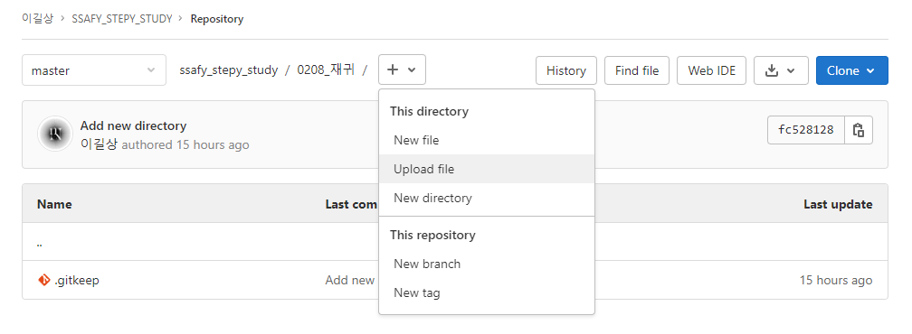

# [2022.02] SSAFY_STEPY_STUDY

## 1. 스터디 목표

- 알고리즘 문제 풀이를 통한 실력 향상!
- 꾸준한 코딩을 통해 JAVA와 Git에 익숙해지기

## 2. 활동 방식

- 매주 **화요일 / 목요일 오후 9시부터 2시간** 진행
- [**단계별로 풀어보기 (acmicpc.net)**](https://www.acmicpc.net/step)  활용하여 문제 선정

[단계별로 풀어보기](https://www.acmicpc.net/step)

- 선정한 문제를 다음 활동까지 해결 후, 각자의 풀이 방법 공유!

## 3. 활동 내역

### [22.02.04]

- 스터디 구성 및 활동 방식 결정, 3문제 선정

### [22.02.08]

- 재귀 - 10870 2447 11729 활동예정

## 4. 기타 확인사항

### GitLab 업로드 방법

1. 브라우저에서 업로드

1. GUI tool 사용(GitKreken)
    - new tab 클릭
    
    
    
    - clone a repo → gitlab 주소 입력 후 위치 지정
    
    
    
    - 변경사항 Add(Stage)
    
    
    
    - 메시지 작성 후 commit
    
    